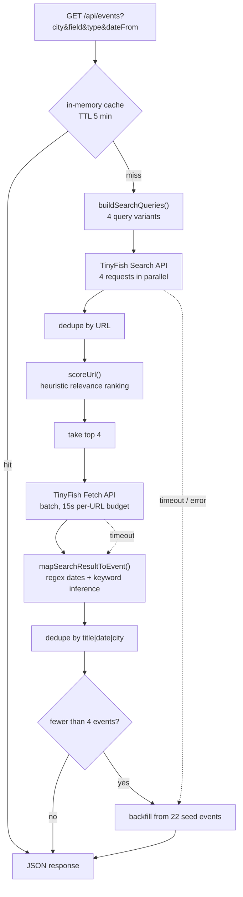

# StudentEvents

Live discovery of hackathons, workshops, meetups and conferences for students in India — assembled at request time from open web search rather than a maintained event database.

**Live:** [student-events-hub.vercel.app](https://student-events-hub.vercel.app)

---

## The problem

Indian student events are scattered across Devfolio, Unstop, Eventbrite, Townscript, college pages and Instagram posts. No single index covers them, and the aggregators that exist are stale because somebody has to enter each event by hand.

This app skips the database. Every request runs a fresh web search, ranks the results, extracts what it can, and returns structured events. The tradeoff — accepted deliberately — is that freshness comes at the cost of extraction accuracy, which is why most of the engineering here is about *filtering out the things that aren't events* rather than about the UI.

---

## Architecture



Two hard timeouts wrap the pipeline — 6s on discovery, 6s on fetch — inside a Vercel function capped at `maxDuration: 30`. Whichever stage fails, the stages below it still produce output.

**Stack:** Vite + React 19 (frontend) · Vercel serverless function (backend) · TinyFish Search + Fetch APIs (data) · no database.

---

## Design decisions

Each of these replaced something that didn't work. The commit history tracks the reasoning.

### 1. Search + Fetch instead of the Agent API

The first working version ran TinyFish's Agent API against discovered pages with a JSON output schema — genuinely better extraction, since an agent can navigate a listing page and pull structured fields.

It was removed (`MAX_AGENT_RUNS = 0`). Agent runs are billed per step and take tens of seconds; four of them did not fit inside the function's time budget on Vercel's Hobby tier. Search + Fetch returns page text, metadata and links in one batched call, fast enough to stay inside 30 seconds.

**The cost:** date and venue extraction is noticeably worse, because regex on page text is a weaker tool than an agent reading the page. The agent path is still in `api/lib/tinyfish.js` behind the `MAX_AGENT_RUNS` constant and can be switched back on where the latency budget allows.

### 2. Heuristic URL scoring, because search results are mostly not events

The first version fetched the top search results directly and produced garbage — blog posts about hackathons, Medium articles, and platform *directory* pages ("all hackathons in Bengaluru") that are indexes, not events.

`scoreUrl()` is a weighted heuristic over the result title, snippet and URL:

| Signal | Weight | Why |
| --- | --- | --- |
| Known event platform in the URL (`devfolio`, `unstop`, `eventbrite`, `townscript`, `skillenza`) | **+20** | Strongest single predictor of a real event page |
| City / field / type term present in the text | +12 / +10 / +10 | Matches the user's filter |
| URL contains a numeric ID segment | +6 | Detail pages have IDs; index pages don't |
| Registration language (`register`, `apply`, `rsvp`) | +6 | Real events have a CTA |
| `blog`, `news`, `medium.com`, `wikipedia` in URL | **−15** | Articles about events, not events |
| Bare directory paths (`/events/`, `/hackathons/`, `/discover`) | **−18** | The listing-page problem specifically |
| Single-segment path with no extension | −12 | Usually a homepage or category root |

**Rejected alternative:** an LLM relevance classifier. It would be more accurate, but it adds a model call per result inside a time budget already spent on search and fetch. A scoring function costs microseconds and got precision to a workable level.

### 3. Fetch concurrency capped at 4, with degradation instead of failure

Fetching every ranked URL blew the time budget and returned nothing at all. The fetch stage is now capped at 4 URLs and wrapped in its own 6-second timeout — and critically, a fetch timeout is **caught, not propagated**. Events still get built from search titles and snippets alone, just without venue, links and metadata.

The principle throughout: every stage degrades to a worse answer rather than to an error. The app has no empty state and no error screen in normal operation.

### 4. `after_date` was removed from the search call

Passing TinyFish's `after_date` filter caused searches to return zero results. Date filtering moved client-side into `extractDate()` + the `dateFrom` filter. Worth knowing before anyone tries to re-add it.

### 5. Three-tier fallback to seed data

22 hand-written sample events across 6 cities and 5 fields backfill any response with fewer than 4 live results, and serve as the complete response when `TINYFISH_API_KEY` is absent. The app is fully functional on a fresh clone with no credentials — which is also what makes the deployed demo reliable.

---

## Extraction: how an event is actually assembled

`mapSearchResultToEvent()` merges three sources per result, in priority order:

- **Title** — OpenGraph `og:title` → search result title → fetched page title
- **Description** — `og:description` → fetched description → search snippet
- **Date** — `extractDate()` runs four regex patterns over the combined text: ISO `YYYY-MM-DD`, `DD Mon YYYY`, `Mon DD, YYYY` (including ranges), and `DDth to DDth Mon YYYY`
- **Registration URL** — first link on the page matching `register|signup|apply|tickets`, else the page URL itself
- **Type / field / city / mode** — keyword inference, overridden by the user's active filter when one is set

Deduplication happens twice: by URL after search, and by `title|startDate|city` after mapping, since the same event legitimately appears across multiple platforms.

---

## Known limitations

These are real and currently unfixed. Listed because anyone reading the output should know what they're looking at.

- **Dates can be fabricated.** When `extractDate()` finds nothing, the event falls back to `addDaysISO(30)` — today plus 30 days. That date is displayed with no indication it's a guess. This is the most significant correctness problem in the project and should be replaced with an explicit `dateUnknown` flag surfaced in the UI.
- **Filters override inference.** If a user filters by "Bengaluru", every returned event is labelled Bengaluru regardless of where it actually is. Filter values are applied as facts rather than as search hints.
- **A stale year is hardcoded.** `buildSearchQueries()` still appends `'2025'` to the first query variant. It should be derived from the current date.
- **Date regexes expire.** `extractDate()` matches `202[5-9]` only, and will silently return empty from 2030 onward.
- **The cache barely works.** `cache` is an in-memory `Map` inside a serverless function, so it's lost on every cold start and isn't shared between concurrent instances. The 5-minute TTL is largely theoretical. A real fix needs Vercel KV or Redis.
- **No extraction accuracy measurement.** Nothing here has been evaluated against labelled data — precision and recall of the pipeline are unknown. This is the most valuable thing that could be added next.
- **Caps at ~4 live events** per request, backfilled with seed data. No pagination.
- **Seed data is pinned** to `new Date('2026-09-06')`, so sample event dates drift into the past over time.
- **No tests and no CI.**

---

## Running it

```bash
npm install
npm run dev          # http://localhost:5173 — serves seed data
```

`/api/events` is a Vercel serverless function and does not run under `vite dev`. For the full pipeline locally:

```bash
npx vercel dev
```

**Environment:**

| Variable | Required | Purpose |
| --- | --- | --- |
| `TINYFISH_API_KEY` | No | Enables live search. Without it, the API serves filtered seed events. Key from [agent.tinyfish.ai](https://agent.tinyfish.ai) |

Requires Node ≥ 20.

### Deploying

Import the repo on Vercel, set `TINYFISH_API_KEY` in project settings, deploy. `vercel.json` handles the build, the `/api/*` rewrite, and sets `X-Content-Type-Options: nosniff` and `X-Frame-Options: DENY`.

---

## API

**`GET /api/events`**

| Query param | Example | Notes |
| --- | --- | --- |
| `city` | `Bengaluru` | One of 6 supported cities |
| `field` | `Data Science` | Technology · Design · Business · Data Science · Product |
| `type` | `Hackathon` | Hackathon · Workshop · Meetup · Conference · Bootcamp |
| `dateFrom` | `2026-10-01` | ISO date, filters seed results |

```jsonc
{
  "source": "tinyfish",        // or "seed"
  "events": [
    {
      "id": "tf-1a2b3c4d5e",
      "title": "…",
      "field": "Technology",
      "type": "Hackathon",
      "city": "Bengaluru",
      "startDate": "2026-10-14",
      "endDate": "2026-10-14",
      "venue": "…",
      "description": "…",
      "registrationUrl": "https://…",
      "organizer": "…",
      "mode": "In-person",      // In-person | Online | Hybrid
      "_source": "tinyfish"     // or "seed"
    }
  ],
  "query": { "city": "Bengaluru", "field": "", "type": "", "dateFrom": "", "search": "" },
  "meta": { "searched": 27, "fetched": 4 }
}
```

The endpoint returns `200` even on pipeline failure, with `source: "seed"` and a `notice` field explaining what degraded. Errors are never surfaced as HTTP failures, because a partial answer is more useful here than a status code.

---

## Project structure

```
student-events-hub/
├── api/
│   ├── events.js              # pipeline: search → rank → fetch → map → dedupe → fallback
│   └── lib/tinyfish.js        # TinyFish Search / Fetch / Agent clients
├── src/
│   ├── App.jsx                # filter state, fetch-on-filter-change, client-side text search
│   ├── components/            # Header, FilterBar, EventCard, EventModal, FavoriteButton
│   ├── hooks/useLocalStorage.js
│   └── data/seedEvents.js     # 22 fallback events, city/field/type vocabularies
├── vercel.json
└── vite.config.js
```

Client-side full-text search runs over already-loaded events and does not re-hit the API; only the four structured filters trigger a refetch. Favourites persist in `localStorage`.

---

## What I'd do next

1. **Measure it.** Hand-label 200 results as event / not-event, and measure the precision of `scoreUrl()`. Every claim in this README about ranking quality is currently an assertion, not a number.
2. **Stop inventing dates.** Replace the 30-day fallback with an explicit unknown state.
3. **Move the cache to Vercel KV** so it survives cold starts and is shared across instances.
4. **Ablate the scoring weights.** They were tuned by hand; nobody knows which of the ten signals actually carry the ranking.

---

*Built by [Tanmay Saini](https://linkedin.com/in/sainitanmay).*
